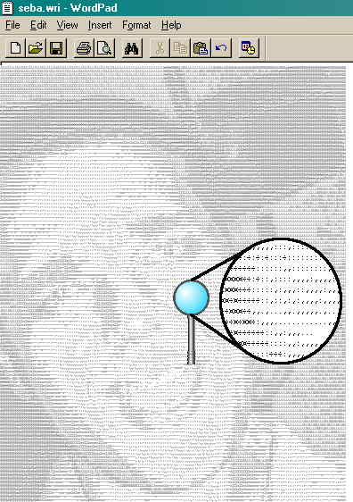



## Bitmap 2 Txt

### Description

Convert any bitmap (16 shades of gray) to text (*.WRI).

Code is very simple... it reads picture loaded in picturebox and then converts pixel by pixel to ASCII code...
 
### More Info
 
picture (about 200x200) 16 shades of gray

same picture in ASCII format

             |
---                |---
**Submitted On**   |2000-06-25 01:48:38
**By**             |[Sebastjan Dobnik](https://github.com/Planet-Source-Code/PSCIndex/blob/master/ByAuthor/sebastjan-dobnik.md)
**Level**          |Beginner
**User Rating**    |5.0 (25 globes from 5 users)
**Compatibility**  |VB 5\.0, VB 6\.0
**Category**       |[Miscellaneous](https://github.com/Planet-Source-Code/PSCIndex/blob/master/ByCategory/miscellaneous__1-1.md)
**World**          |[Visual Basic](https://github.com/Planet-Source-Code/PSCIndex/blob/master/ByWorld/visual-basic.md)
**Archive File**   |[CODE\_UPLOAD72186272000\.zip](https://github.com/Planet-Source-Code/sebastjan-dobnik-bitmap-2-txt__1-9223/archive/master.zip)

